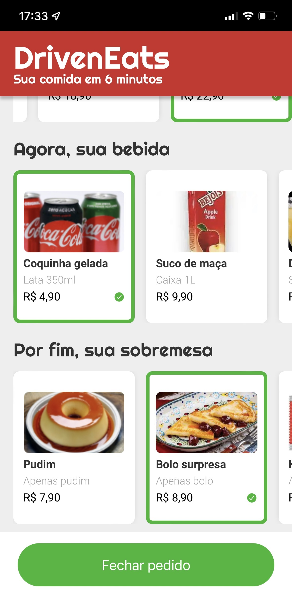

# <p align = "center"> Projeto #03 - DrivenEats </p>

<p align = "center">

</br>
<br/>

<p align = "center"> </p>

</br>

## ✏️ Descrição

<p align="justify" >Projeto usando JavaScript para a implementação do site mobile do DrivenEats, um restaurante especial que entrega seu pedido em 6 minutos.
Para isso, o restaurante só trabalha com um tipo específico de pedido: o combo de Prato+Bebida+Sobremesa.
O site permite de forma fácil a escolha do seu combo, enviando em seguida o pedido por WhatsApp diretamente para o restaurante.</p>

</br>

## <p align = "left"> :white_circle: Tecnologias</p>

- 
- 
- 

</br>

# Layout

[DrivenEats](https://www.figma.com/file/i8tceg0W7Z9FfANaDbR3FV/DrivenEats)

</br>

# 🏁 Vamos lá

Primeiro clone o repositório remoto para o seu computador e abra a pasta criada

```bash
git clone https://github.com/driven-education-cfigueiroa/projeto3-driveneats.git && cd projeto3-driveneats
```

E depois, abra o arquivo index.html no seu navegador padrão.
