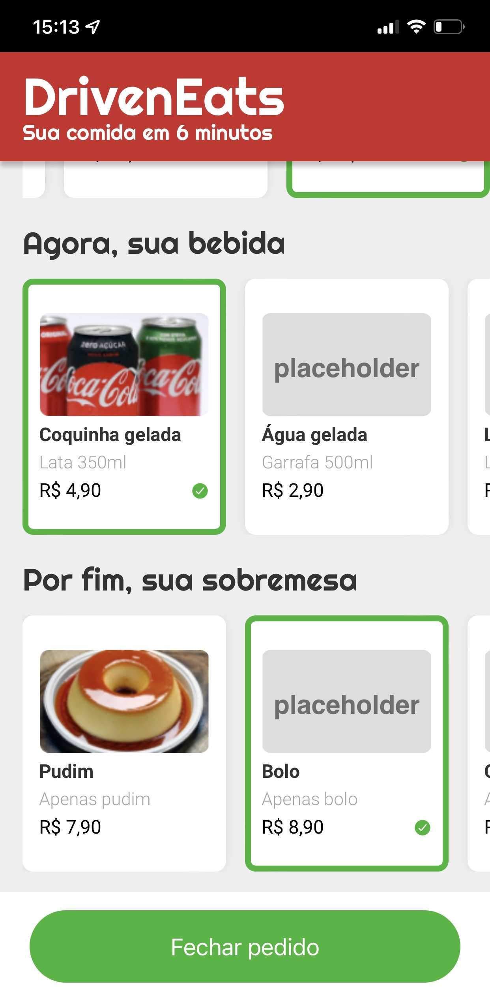

# <p align = "center"> Projeto #03 - DrivenEats </p>

<p align = "center">

</br>
<br/>

<p align = "center"> </p>

</br>

## ✏️ Descrição

<p align="justify" >Seu primeiro projeto usando JavaScript será a implementação do site mobile do DrivenEats, um restaurante especial que entrega seu pedido em 6 minutos.
Para isso, o restaurante só trabalha com um tipo específico de pedido: o combo de Prato+Bebida+Sobremesa.
O site permite de forma fácil a escolha do seu combo, enviando em seguida o pedido por WhatsApp diretamente para o restaurante.</p>

</br>

## <p align = "left"> :white_circle: Tecnologias</p>

- 
- 
- 

</br>

# ✔️ Requisitos

- Versionamento
  - [X] Versionamento usando Git é obrigatório, crie um **repositório público** no seu perfil do GitHub
  - [X] Faça commits a cada funcionalidade implementada
- Layout
  - [X] Aplicar layout para mobile, seguindo imagens fornecida (não é necessário implementar um layout para desktop)
  - [X] O topo e o botão de fechar pedido devem ter posicionamento fixo e não rolar com a barra de rolagem
  - [X] Você pode usar imagens e textos aleatórios para ilustrar a página, porém varie o preço em cada item da mesma categoria
  - [X] As fontes utilizadas são: [Righteous](https://fonts.google.com/specimen/Righteous) (nome do restaurante e títulos das categorias) e [Roboto](https://fonts.google.com/specimen/Roboto) (demais textos)
  - [X] Para fazer as sombras presentes em alguns elementos, pesquise sobre como aplicar sombras em CSS e brinque com os valores até ficar parecido com as imagens do layout
  - [X] Para fazer os produtos rolarem horizontalmente, utilize `overflow-x: scroll`. No modo desktop um scroll é exibido, mas no modo celular não.
- Seleção de itens
  - [X] Ao clicar sobre um item, o mesmo deve ser marcado como selecionado, seguindo layout da tela 3
  - [X] Ao clicar em um item, caso já exista um item selecionado na mesma categoria, este deve ser desmarcado e o novo item clicado deve ser o novo selecionado
  - [X] Ao clicar em um item já marcado, **não** é necessário desmarcá-lo
- Botão de finalizar pedido
  - [X] Por padrão, o botão de finalizar pedido deve vir desabilitado. Ao clicar no botão nesse estado, nada deve acontecer.
  - [X] Quando o usuário tiver selecionado os itens das 3 categorias, o botão deve mudar para o estado de habilitado, seguindo layout da tela 5
- Envio do pedido
  - [X] Ao finalizar o pedido, o usuário deverá ser encaminhado para o **WhatsApp Web**, em conversa com o contato do restaurante, já com uma mensagem padrão preenchida
    **Dica**: Para criar um link que envia uma mensagem via WhatsApp, veja essa página de ajuda do WhatsApp: [https://faq.whatsapp.com/general/chats/how-to-use-click-to-chat?lang=pt](https://faq.whatsapp.com/general/chats/how-to-use-click-to-chat?lang=pt)
    **Dica 2**: Para preparar a mensagem para o formato que o WhatsApp espera, pesquise por uma função chamada `encodeURIComponent(minhaString)`
  - [X] Essa mensagem deverá seguir este **formato** (igualzinho, sem nenhum caracter a mais):
    ```css
    Olá, gostaria de fazer o pedido:
    - Prato: Frango Yin Yang
    - Bebida: Coquinha Gelada
    - Sobremesa: Pudim
    Total: R$ 27.70
    ```
    **Dica**: para formatar um número decimal no formato 27.70, pesquise por `toFixed`

# Bônus (opcional)

- Bônus 1: Peça o nome e endereço
  Ao clicar em finalizar pedido, lance dois `prompt` para o usuário solicitando seu nome e endereço. Essas informações devem então serem adicionadas na mensagem final que é enviada por WhatsApp nesse **formato** (igualzinho, sem nenhum caracter a mais):
  ```
  Olá, gostaria de fazer o pedido:
  - Prato: Frango Yin Yang
  - Bebida: Coquinha Gelada
  - Sobremesa: Pudim
  Total: R$ 27.70

  Nome: Fulano
  Endereço: Rua...
  ```
- Bônus 2: Confirme os dados antes de finalizar o pedido
  Ao clicar em "Finalizar pedido", em vez de ir para o WhatsApp direto, primeiro revise a compra seguindo a tela Bônus disponível no Figma.

# Layout

[DrivenEats](https://www.figma.com/file/i8tceg0W7Z9FfANaDbR3FV/DrivenEats)

# Driven Code Time

- Nomeie a pasta do seu projeto com: `projeto3-driveneats`

</br>

# 🏁 Vamos lá

Primeiro clone o repositório remoto para o seu computador e abra a pasta criada

```bash
git clone https://github.com/driven-education-cfigueiroa/projeto3-driveneats.git && cd projeto3-driveneats
```

E depois, abra o arquivo index.html no seu navegador padrão.
